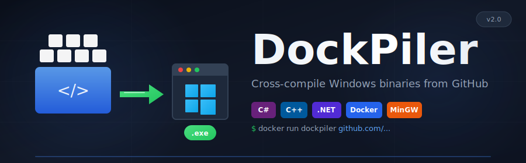

<p align="center">
  
</p>

<p align="center">
  <strong>Cross-compile Windows executables from GitHub repositories using Docker</strong>
</p>

<p align="center">
  <a href="#features">Features</a> •
  <a href="#quick-start">Quick Start</a> •
  <a href="#installation">Installation</a> •
  <a href="#usage">Usage</a> •
  <a href="#examples">Examples</a> •
  <a href="#supported-projects">Supported Projects</a>
</p>

<p align="center">
  
  
  
  
</p>

---

## Overview

**DockPiler** is a powerful Docker-based tool that automatically clones, compiles, and cross-compiles Windows executables from GitHub repositories — all from Linux or macOS. Perfect for security researchers, penetration testers, and developers who need to build Windows tools without a Windows machine.

```
┌─────────────────────────────────────────────────────────────────┐
│                                                                 │
│   GitHub Repository ──► DockPiler Container ──► Windows .exe   │
│                                                                 │
│   • C# (.NET Framework 4.0-4.8.1)                              │
│   • C# (Modern .NET 6/7/8)                                     │
│   • C++ (Visual Studio Projects)                               │
│   • C++ (CMake / Makefile)                                     │
│                                                                 │
└─────────────────────────────────────────────────────────────────┘
```

## Features

| Feature | Description |
|---------|-------------|
| **Multi-Language** | C#, C++, and C with automatic project detection |
| **Solution Support** | Parses `.sln` files and builds projects in dependency order |
| **Smart Parsing** | Extracts compiler flags, definitions, and libraries from `.vcxproj` |
| **Framework Support** | All .NET Framework versions from 4.0 to 4.8.1 |
| **Cross-Compilation** | Produces native Windows x64 or x86 executables |
| **Git Integration** | Clone specific branches, tags, or commits with submodule support |
| **Build Configs** | Debug and Release configurations |
| **Optional Components** | vcpkg for C++ dependencies, MSVC via Wine for compatibility |

## Quick Start

```bash
# Build the Docker image
docker build -t dockpiler .

# Compile any GitHub repository
docker run -v $(pwd)/output:/output dockpiler https://github.com/GhostPack/Rubeus.git

# Your Windows executable is now in ./output/
```

## Installation

### Prerequisites

- Docker installed on Linux or macOS
- Internet connection for cloning repositories

### Build Options

Choose the build variant that fits your needs:

```bash
# Standard build (~2GB) - MinGW cross-compiler
docker build -t dockpiler .

# With vcpkg (~2.5GB) - C++ package management
docker build -t dockpiler --build-arg INCLUDE_VCPKG=true .

# With MSVC (~10GB+) - Full Visual Studio compatibility via Wine
docker build -t dockpiler --build-arg INCLUDE_MSVC=true .

# Full build (~12GB) - Everything included
docker build -t dockpiler-full \
    --build-arg INCLUDE_VCPKG=true \
    --build-arg INCLUDE_MSVC=true .
```

| Build Argument | Default | Description | Size Impact |
|----------------|---------|-------------|-------------|
| `INCLUDE_VCPKG` | `false` | vcpkg C++ package manager | +500MB |
| `INCLUDE_MSVC` | `false` | MSVC compiler via Wine (x86_64 only) | +8GB |

> **Note for Apple Silicon / ARM users:** The MSVC option requires x86_64 architecture and will be automatically skipped on ARM with a warning. MinGW cross-compilation works perfectly on ARM.

## Usage

```bash
docker run -v $(pwd)/output:/output dockpiler <github_url> [arch] [config] [git_ref] [extra_flags]
```

### Parameters

| Parameter | Required | Default | Options | Description |
|-----------|----------|---------|---------|-------------|
| `github_url` | Yes | - | - | GitHub repository URL |
| `arch` | No | `x64` | `x64`, `x86` | Target architecture |
| `config` | No | `Release` | `Release`, `Debug` | Build configuration |
| `git_ref` | No | default branch | branch/tag/commit | Git reference to checkout |
| `extra_flags` | No | - | - | Additional compiler flags |

## Examples

### C# Projects

```bash
# Compile Rubeus (default x64 Release)
docker run -v $(pwd)/output:/output dockpiler \
    https://github.com/GhostPack/Rubeus.git

# Compile Seatbelt for x86
docker run -v $(pwd)/output:/output dockpiler \
    https://github.com/GhostPack/Seatbelt.git x86

# Compile SharpHound with Debug symbols
docker run -v $(pwd)/output:/output dockpiler \
    https://github.com/BloodHoundAD/SharpHound.git x64 Debug
```

### C++ Projects

```bash
# Compile PPLcontrol
docker run -v $(pwd)/output:/output dockpiler \
    https://github.com/itm4n/PPLcontrol.git

# Compile a specific release tag
docker run -v $(pwd)/output:/output dockpiler \
    https://github.com/example/project.git x64 Release v1.2.0

# With extra compiler flags
docker run -v $(pwd)/output:/output dockpiler \
    https://github.com/example/project.git x64 Release "" "-DEXTRA_DEFINE"
```

## Supported Projects

### Build Systems

| Type | Detection | Notes |
|------|-----------|-------|
| Visual Studio Solution | `.sln` | Builds projects in dependency order |
| Visual Studio C++ | `.vcxproj` | Full project parsing |
| C# Project | `.csproj` | .NET Framework & modern .NET |
| CMake | `CMakeLists.txt` | Native support |
| Makefile | `Makefile` | Uses MinGW compilers |
| Standalone | `.c`, `.cpp` files | Auto-generates CMakeLists.txt |

### .NET Framework Versions

All versions supported with proper reference assemblies:

```
4.0 • 4.5 • 4.5.1 • 4.5.2 • 4.6 • 4.6.1 • 4.6.2 • 4.7 • 4.7.1 • 4.7.2 • 4.8 • 4.8.1
```

### C++ Features

- **Automatic vcxproj Parsing**: Extracts preprocessor definitions, include directories, libraries
- **MSVC Compatibility**: Handles MSVC-specific extensions and variadic macros
- **Resource Compilation**: Compiles `.rc` files with windres
- **50+ Library Mappings**: Automatic Windows to MinGW library translation

## Output

Compiled binaries are saved to your mounted output directory:

```
./output/
├── ProjectName/
│   ├── ProjectName.exe      # Your Windows executable
│   └── ProjectName.dll      # Any DLL dependencies
└── logs/                    # Build logs (on failure)
    ├── diagnostics.txt
    └── build.log
```

## Architecture

```
DockPiler/
├── Dockerfile              # Multi-stage build with optional components
├── scripts/
│   ├── entrypoint.sh       # Main build orchestration
│   ├── vcxproj_parser.py   # Visual Studio project parser
│   ├── sln_parser.py       # Solution file parser
│   ├── cmake_generator.py  # CMakeLists.txt generator
│   └── library_mapper.py   # Windows → MinGW library mapping
├── toolchain/
│   ├── mingw-x64.cmake     # x64 cross-compilation toolchain
│   └── mingw-x86.cmake     # x86 cross-compilation toolchain
└── README.md
```

## Troubleshooting

### Build Fails with Missing Libraries

DockPiler includes 50+ common Windows libraries. For additional libraries:

1. Check if available in MinGW-w64
2. Add to `library_mapper.py`
3. Or pass via `extra_flags`: `-lmylibrary`

### C++ Compilation Issues

| Issue | Solution |
|-------|----------|
| Case sensitivity errors | Automatic - files are lowercased |
| MSVC variadic macros | Automatic - `__VA_ARGS__` is patched |
| Missing Windows SDK | Use MSVC build variant |
| Complex dependencies | Use vcpkg build variant |

### .NET Framework Issues

| Issue | Solution |
|-------|----------|
| Unsupported framework | Version is auto-detected (4.0-4.8.1) |
| COM references | May require Windows; test on target |
| WPF/WinForms | Limited support in cross-compilation |

### View Build Logs

```bash
cat ./output/logs/diagnostics.txt
cat ./output/logs/build.log
```

## Limitations

- **Public repositories only** - Private repo support not yet implemented
- **Some Windows APIs unavailable** - MinGW doesn't include all Windows SDK headers
- **ATL/MFC not supported** - Use MSVC build variant for these
- **UWP/WinRT not supported** - Desktop applications only
- **No runtime testing** - Binaries are compiled but not executed

## Contributing

Contributions are welcome! Areas for improvement:

- [ ] Private repository authentication
- [ ] Additional library mappings
- [ ] NuGet package support for C++
- [ ] Parallel project building
- [ ] Build caching

## License

This project is provided as-is for educational and development purposes.

---

<p align="center">
  <sub>Built for security researchers, penetration testers, and developers who need Windows tools without Windows.</sub>
</p>
